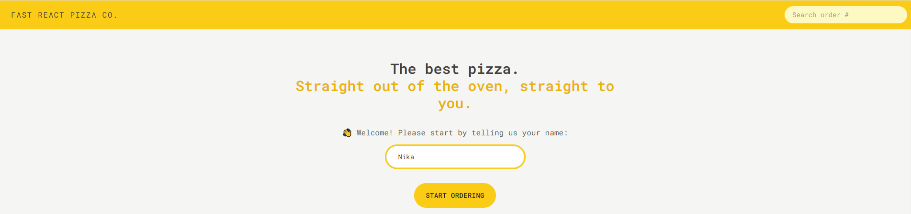
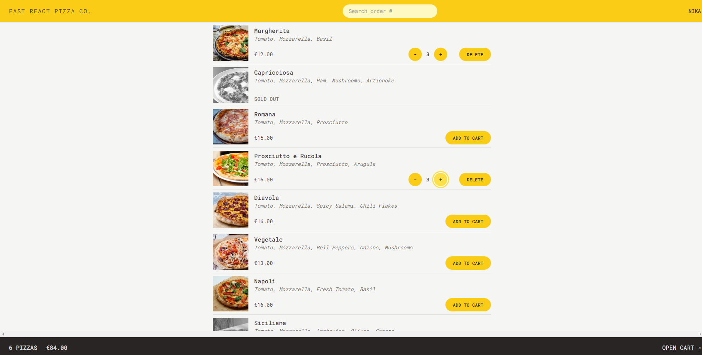
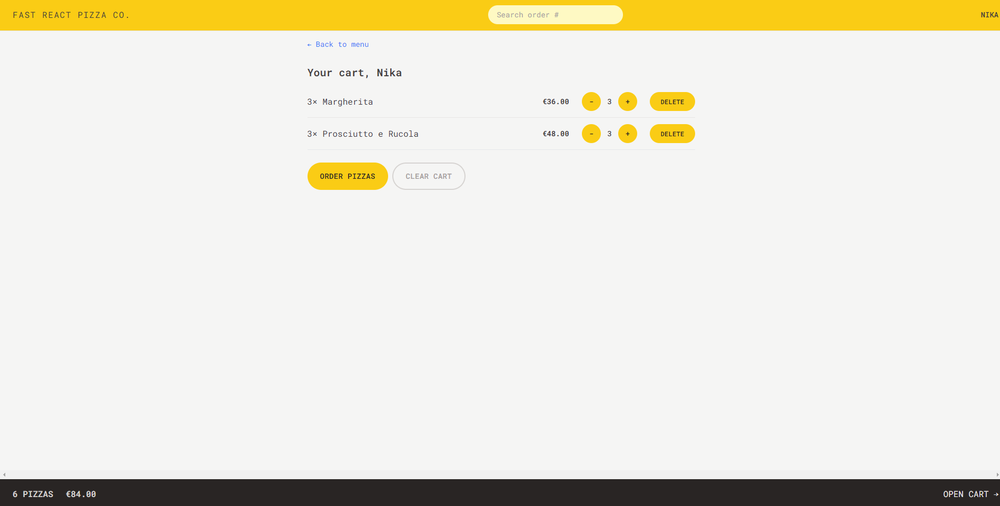
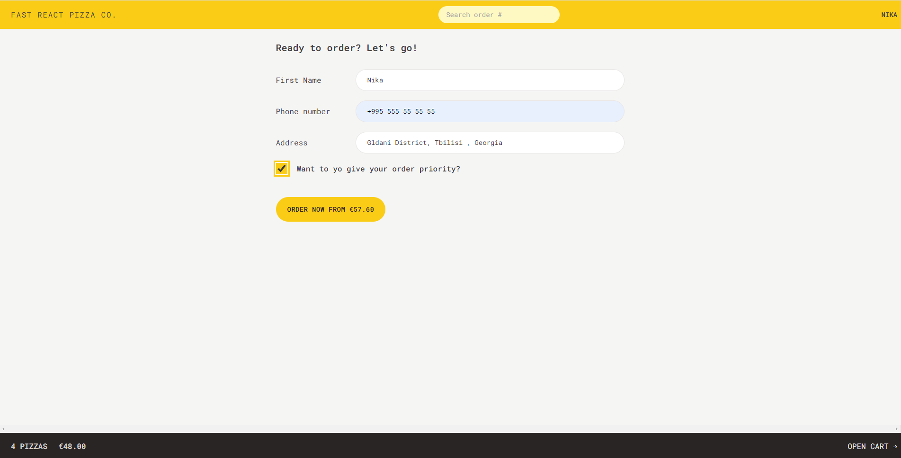
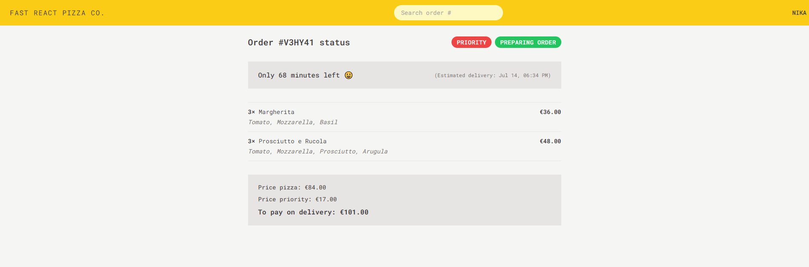

# Fast-React-Pizza

## Table of contents

- [Overview](#overview)
  - [Review](#Review)
  - [Screenshots](#screenshots)
  - [Link](#link)
  - [Built with](#built-with)
- [Author](#author)

## Overview

### Review

Fast-React-Pizza project: You can choose the desired pizza, add it to the cart and order it 😊 🍕.

### Screenshots

### Link

- Solution URL: [GitHub](https://github.com/nikamerebashvili95/fast-react-pizza)

### Built with

- React
- Vite
- Redux
- Router
- Tailwind
- API

## Author

- GitHub - [Nika Merebashvili](https://github.com/nikamerebashvili95)
- LinkedIn - [Nika Merebashvili](https://www.linkedin.com/in/nikamerebashvili)
